#  WanderLust AI

> **An AI-powered vacation rental platform built with the MERN stack.**

WanderLust AI is a full-stack web application that enables users to discover unique stays, make secure bookings, and manage travel with intelligent AI-powered features. Alongside a seamless booking experience, the platform provides hosts with tools for property management, booking analytics, and automated content generation.

**Status:**  Feature Complete &nbsp; | &nbsp;  Deployment Coming Soon


##  Table of Contents

- [Project Preview](#-project-preview)
- [Key Highlights](#-key-highlights)
- [Tech Stack](#-tech-stack)
- [Getting Started](#-getting-started)
- [Environment Variables](#-environment-variables)
- [Feature Showcase](#-feature-showcase)
- [Future Enhancements](#-future-enhancements)
- [Author](#-author)

##  Project Preview

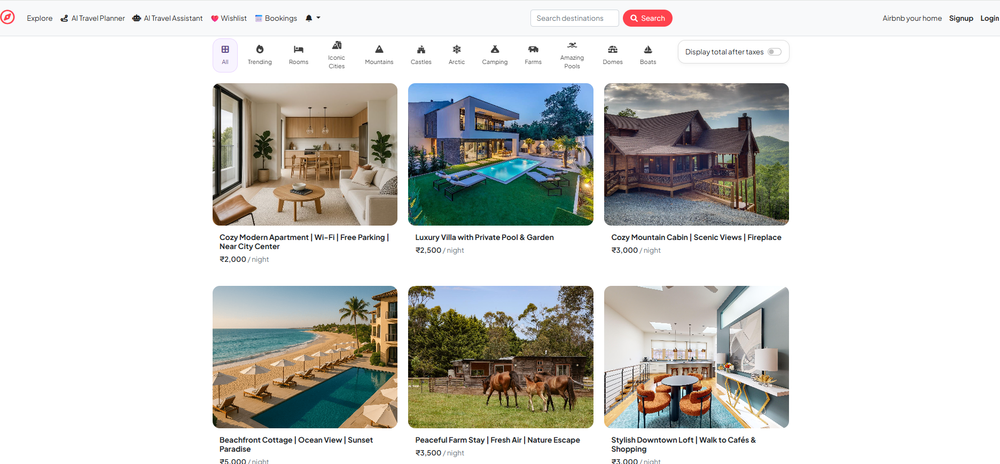

##  Key Highlights

-  AI-powered tools for property description generation, content enhancement, and travel planning.
-  Complete property listing management with image uploads and interactive maps.
-  Smart booking system featuring live price calculation and double-booking prevention.
-  Personalized user experience with wishlists, reviews, profiles, and notifications.
-  Dedicated host dashboard with booking insights, revenue analytics, and PDF report generation.
-  Automated email confirmations for a seamless booking experience.

 ##  Tech Stack

| Category | Technologies |
|----------|--------------|
| **Frontend** | HTML5, CSS3, Bootstrap, JavaScript, EJS |
| **Backend** | Node.js, Express.js |
| **Database** | MongoDB, Mongoose |
| **Authentication** | Passport.js, Express Session |
| **Cloud Services** | Cloudinary, Mapbox |
| **AI Integration** | Google Gemini API |
| **Email Service** | Nodemailer |
| **PDF Generation** | PDFKit |
| **Version Control** | Git, GitHub |

##  Getting Started

### 1. Clone the repository

```bash
git clone https://github.com/nimmisahu222716-lab/wanderlust-ai-travel.git
```

### 2. Navigate to the project

```bash
cd wanderlust-ai-travel
```

### 3. Install dependencies

```bash
npm install
```

### 4. Start the development server

```bash
npm run dev
```

For production:

```bash
npm start
```

Visit:

```
http://localhost:8080
```
##  Environment Variables

Create a `.env` file in the project root and configure the following variables:

```env
ATLASDB_URL=

SESSION_SECRET=

CLOUD_NAME=
CLOUD_API_KEY=
CLOUD_API_SECRET=

MAP_TOKEN=

EMAIL_USER=
EMAIL_PASS=

GEMINI_API_KEY=
```

##  Feature Showcase

###  Home Page

Explore featured listings, categories, and a clean, user-friendly interface.


---

###  Property Details

View detailed property information, pricing, amenities, and images.

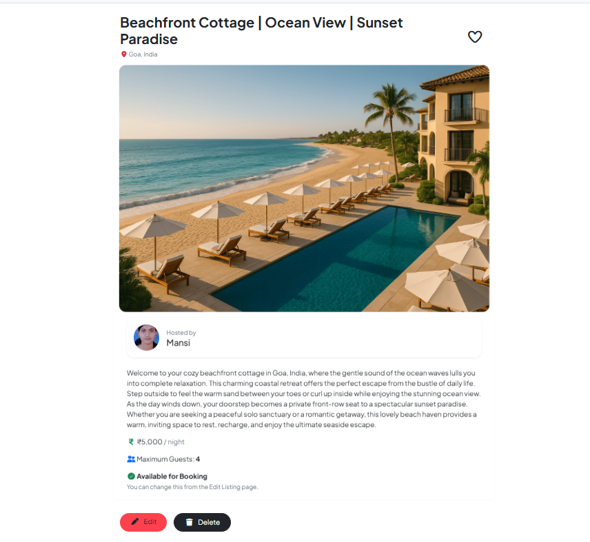

---

###  Reviews & Interactive Map

Read user reviews and view the property's location with Mapbox integration.

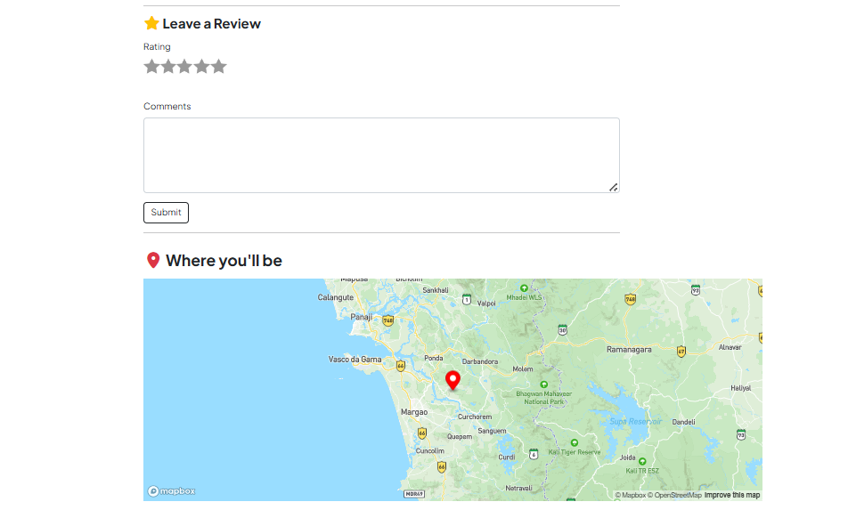

---

###  AI Travel Planner

Generate personalized travel plans based on your destination and preferences.

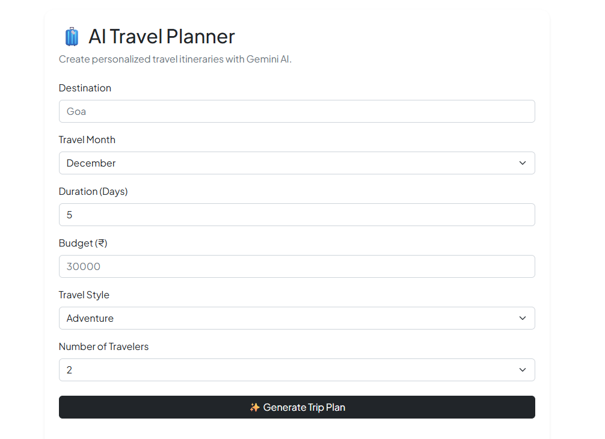

---

###  AI Travel Assistant

Get instant travel recommendations and assistance using AI.

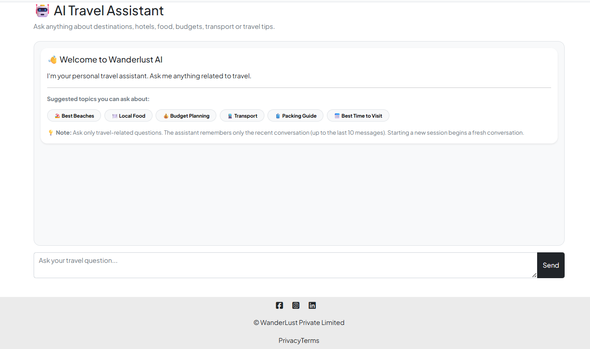

---

###  Booking System

Book properties with live price calculation and double-booking prevention.

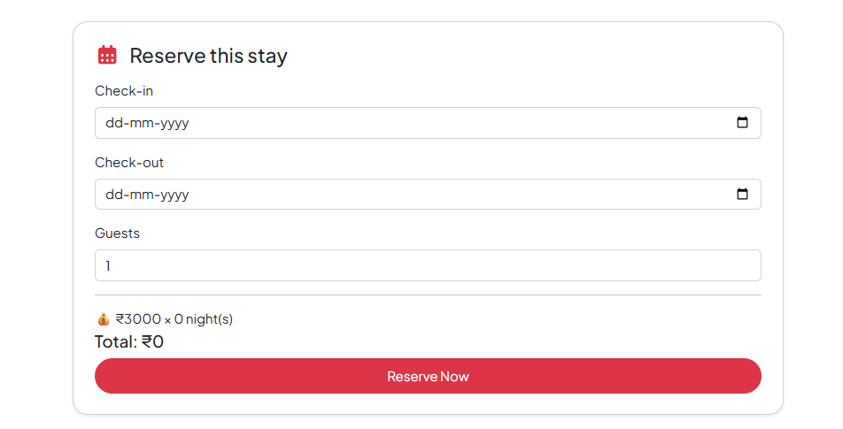

---

###  Host Dashboard – Overview

Monitor bookings, listings, and key platform statistics.

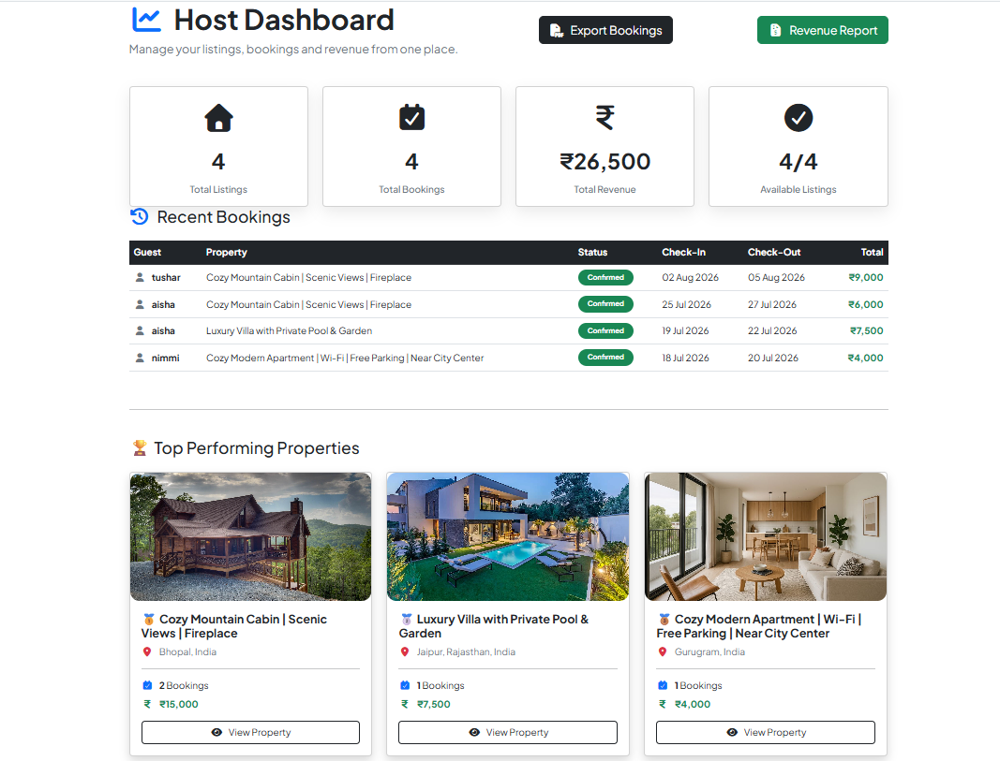

---

###  Host Dashboard – Revenue Analytics

Track earnings and booking insights with detailed analytics.

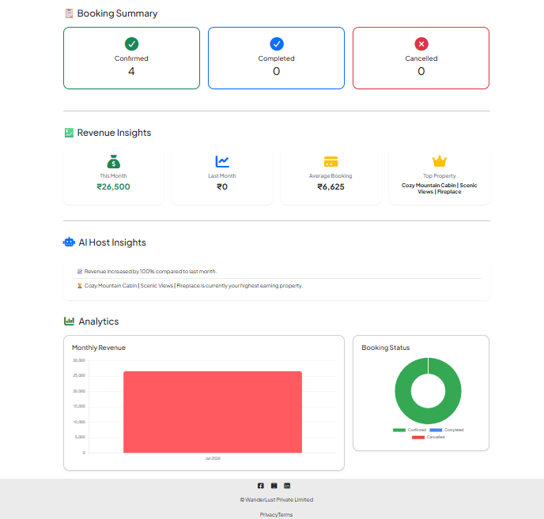

---

### ➕ Create Listing

Create a new property listing with images, location, pricing, and other details.

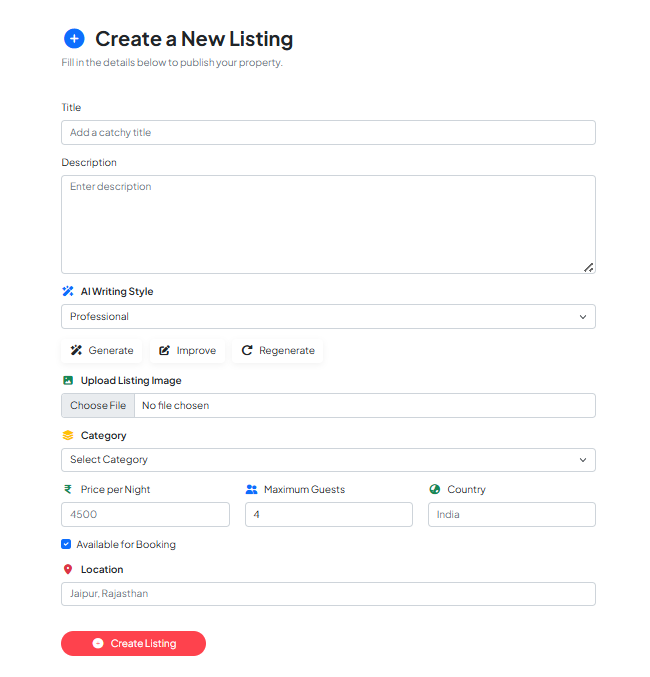

---

###  Edit Listing

Update listing details anytime through an intuitive editing interface.

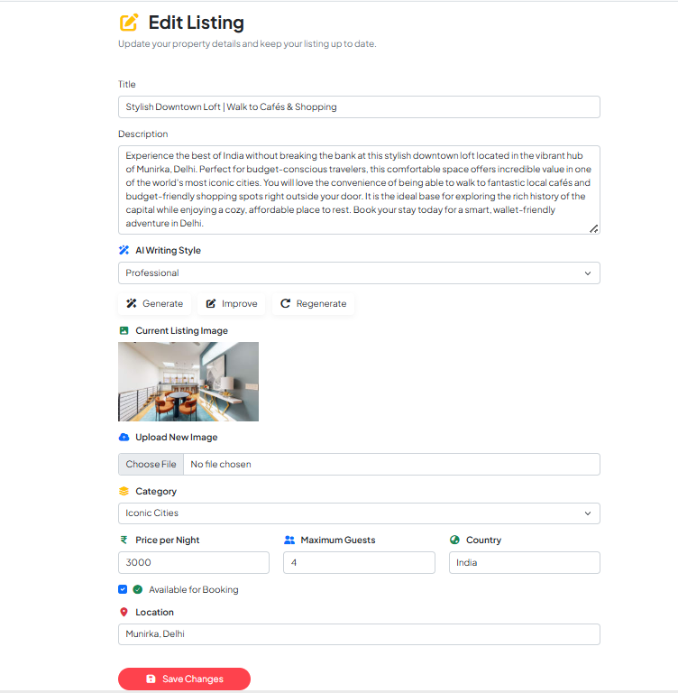

---

### 👤 User Profile

Manage profile information and access personalized account details.

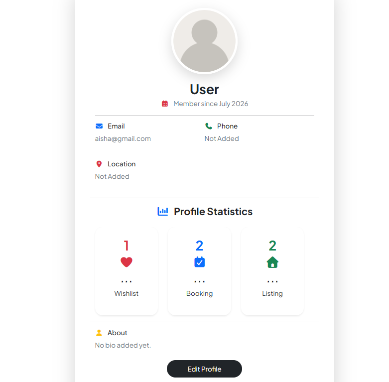

##  Future Enhancements

- Secure online payment integration
- Advanced property search and filtering
- Calendar synchronization
- Multi-language support

##  Author

**Nimmi Sahu**

- MCA Student, Jawaharlal Nehru University (JNU)
- Full Stack MERN Developer

- **GitHub:** https://github.com/nimmisahu222716-lab
- **LinkedIn:** www.linkedin.com/in/nimmi-sahu-511b77324

##  Support

If you found this project useful, consider giving it a ⭐ on GitHub.